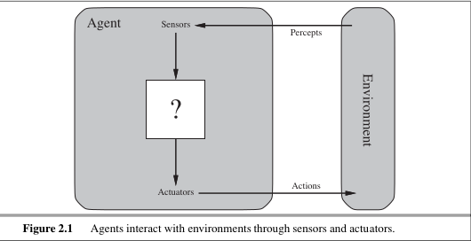
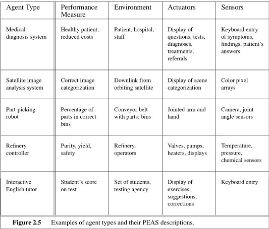
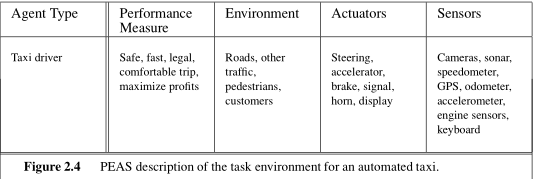
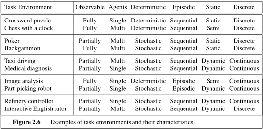
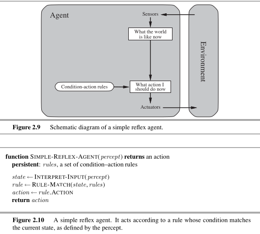
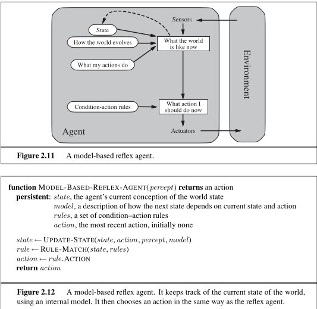
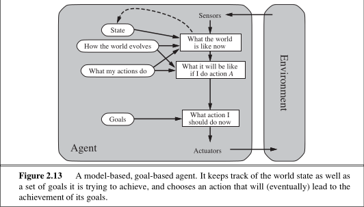
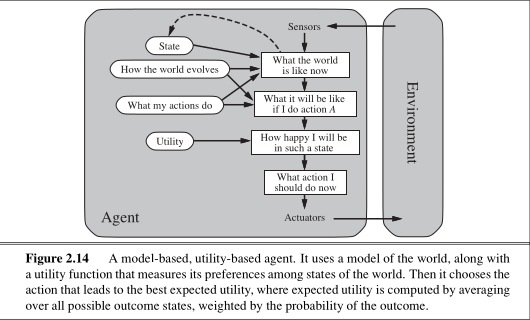
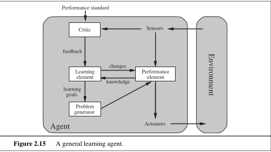

# MODULE 1: INTRODUCTION TO ARTIFICIAL INTELLIGENCE

## 1. What is Artificial Intelligence (AI)?

### Definition & Key Concepts

Artificial Intelligence (AI) is a field of science and engineering concerned with building intelligent entities and understanding computational models of intelligence. AI is a universal field relevant to any intellectual task, ranging from general domains (learning, perception) to specific tasks (playing chess, proving mathematical theorems, driving cars, diagnosing diseases).

### The Four Approaches to Defining AI

AI definitions are classified along two dimensions:

* **Thought Processes vs. Behavior**
* **Human Performance vs. Ideal Standard (Rationality)**

| Dimension | Human-Centered | Rationality-Centered |
| :--- | :--- | :--- |
| **Thought Processes** | **Thinking Humanly** _"Cognitive Modeling Approach"_ | **Thinking Rationally** _"'Laws of Thought' Approach"_ |
| **Behavior** | **Acting Humanly** _"Turing Test Approach"_ | **Acting Rationally** _"Rational Agent Approach"_ |

---

### A. Acting Humanly: The Turing Test Approach

Proposed by **Alan Turing (1950)** to provide an operational definition of intelligence. A computer passes the test if a human interrogator cannot distinguish whether written responses came from a human or a computer.

#### Capabilities Required to Pass the Turing Test:

* **Natural Language Processing (NLP):** To communicate successfully in human languages.
* **Knowledge Representation:** To store information acquired before or during the test.
* **Automated Reasoning:** To use stored information to answer questions and draw conclusions.
* **Machine Learning:** To adapt to new circumstances and detect patterns.

#### Total Turing Test

Includes a video signal and physical hatch to test perceptual and manipulation skills:

* **Computer Vision:** To perceive objects.
* **Robotics:** To manipulate objects and move around.

---

### B. Thinking Humanly: The Cognitive Modeling Approach

Focuses on determining how human minds think and building computational models of human thought processes.

#### Methods to Determine Human Thinking:

1. **Introspection:** Catching our own thoughts as they pass.
2. **Psychological Experiments:** Observing a person in action.
3. **Brain Imaging:** Observing the brain in action (e.g., fMRI, EEG).

> **Cognitive Science:** An interdisciplinary field combining AI computer models and experimental psychology techniques to construct testable theories of the human mind.

* **Historical Example:** Allen Newell and Herbert Simon’s **GPS (General Problem Solver)** compared its reasoning steps directly to human subjects solving identical problems.

---

### C. Thinking Rationally: The "Laws of Thought" Approach

Pioneered by **Aristotle**, who introduced syllogisms (patterns for argument structures that always yield correct conclusions given correct premises).

* **Logicist Tradition:** Hopes to build intelligent systems using formal logical notation.

#### Main Obstacles:

1. Informal, real-world knowledge is difficult to state in formal logical terms, especially when knowledge is uncertain.
2. Solving a problem *"in principle"* differs from doing it *"in practice"*—a combinatorial explosion of facts can exhaust computational resources.

---

### D. Acting Rationally: The Rational Agent Approach

An **agent** is an entity that perceives its environment through sensors and acts upon it through actuators. A **rational agent** acts to achieve the best outcome or the best expected outcome under uncertainty.

#### Advantages over Other Approaches:

* **More general** than "Thinking Rationally" because correct inference is only one mechanism for achieving rationality (e.g., reflex actions work without inference).
* **More mathematically well-defined** and amenable to scientific development than human-centered standards.

---

## 2. Foundations of Artificial Intelligence

AI is built on foundational ideas, theories, and techniques from multiple disciplines:

| Discipline | Key Questions Addressed | Major Contributions to AI |
| :--- | :--- | :--- |
| **Philosophy** | • Can formal rules be used to draw valid conclusions? • How does the mind arise from a physical brain? • Where does knowledge come from, and how does it lead to action? | Aristotle's syllogisms; Dualism vs. Materialism; Empiricism (Bacon, Locke); Logical Positivism (Carnap); Aristotle's goal-action connection algorithm (basis of GPS). |
| **Mathematics** | • What are formal rules for valid conclusions? • What can be computed? • How do we reason under uncertainty? | Boolean Logic (Boole); First-Order Logic (Frege); Gödel's Incompleteness Theorem; Turing Machines & Computability; NP-Completeness & Tractability (Cook, Karp); Probability Theory & Bayes' Rule. |
| **Economics** | • How should decisions be made to maximize payoff? • How to make decisions when payoffs are far in the future? | Utility Theory (Walras, Ramsey); Decision Theory (Probability + Utility); Game Theory (von Neumann, Morgenstern); Markov Decision Processes (Bellman); Satisficing (Simon). |
| **Neuroscience** | • How do brains process information? | Study of neurons and synaptic connections (Golgi, Cajal); Brain functional localization (Broca); Brain-computer resource comparisons (cycle time vs. parallel structure). |
| **Psychology** | • How do humans and animals think and act? | Behaviorism (Watson); Cognitive Psychology (Craik's 3-step mental model); View of brain as an information-processing device. |
| **Computer Engineering** | • How can we build an efficient computer? | Babbage's Analytical Engine; Early electronic computers (Z3, ABC, ENIAC); AI programming tools: Lisp, time-sharing, OOP, automatic memory management. |
| **Control Theory & Cybernetics** | • How can artifacts operate under their own control? | Feedback control loops (Ktesibios, Watt); Cybernetics (Wiener, Ashby); Stochastic optimal control & minimizing error/objective functions over time. |
| **Linguistics** | • How does language relate to thought? | Chomsky's Syntactic Structures & generative grammar; Computational Linguistics & Natural Language Processing (NLP); Knowledge Representation tied to language. |

---

## 3. History of AI

### Gestation of AI (1943–1955)
* **1943:** Warren McCulloch and Walter Pitts proposed the first model of artificial neural networks.
* **1949:** Donald Hebb proposed Hebbian learning for neural connection strength.
* **1950:** Turing published *"Computing Machinery and Intelligence"* introducing the Turing Test, Machine Learning, and Reinforcement Learning.

### Birth of AI (1956)
* **Dartmouth Workshop (Summer 1956):** Organized by John McCarthy, Marvin Minsky, Claude Shannon, and Nathaniel Rochester.
* **John McCarthy** officially coined the term *"Artificial Intelligence"*.
* **Allen Newell and Herbert Simon** presented the Logic Theorist (LT), capable of proving mathematical theorems.

### Early Enthusiasm & Great Expectations (1952–1969)
* **General Problem Solver (GPS):** Developed by Newell & Simon to imitate human problem-solving steps.
* **Physical Symbol System Hypothesis:** Proposed by Newell & Simon—states that a physical symbol system has necessary and sufficient means for general intelligent action.
* **1958:** John McCarthy invented Lisp (dominant AI language), invented time-sharing, and published *"Programs with Common Sense"* (describing the Advice Taker).
* **Microworlds:** Development of AI in restricted domains (e.g., Tom Evans' ANALOGY, Winograd's SHRDLU in the Blocks World).

### A Dose of Reality / AI Winter (1966–1973)
* Translation systems failed due to a lack of background context.
* Combinatorial explosion limited search-based methods.
* **1969:** Minsky and Papert published *Perceptrons*, proving that single-layer perceptrons could not learn simple functions like XOR, leading to a halt in neural net funding.
* **1973:** The Lighthill Report in the UK led to major cuts in AI research funding.

### Knowledge-Based Systems (1969–1979)
* Transition from "weak methods" (general domain-independent search) to "strong methods" (domain-specific knowledge).
* **DENDRAL (1969):** Inferring molecular structure from mass spectrometer data.
* **MYCIN:** Expert system for medical diagnosis using ~450 rules and certainty factors for handling uncertainty.

### AI Becomes an Industry (1980–Present)
* **1980:** DEC deployed R1 (XCON), saving ~$40 million annually.
* **1981:** Japan launched the Fifth Generation Project.

### Return of Neural Networks (1986–Present)
* Reinvention and popularization of the **Back-propagation** algorithm for multi-layer networks.

### AI Adopts Scientific Method (1987–Present)
* Integration of **Hidden Markov Models (HMMs)** in speech recognition.
* Adoption of **Bayesian Networks** (Judea Pearl) for formal probabilistic reasoning.

### Big Data Era (2001–Present)
* Shift toward **data-driven AI** where huge amounts of unlabeled training data outperform minor algorithmic variations.

---

## 4. Applications of AI

### State-of-the-Art Real-World Applications

* **Robotic Vehicles:** Autonomous driving (e.g., STANLEY winning the 2005 DARPA Grand Challenge; CMU’s BOSS winning the Urban Challenge).
* **Speech Recognition & Dialogue Systems:** Automated flight-booking services via natural conversation.
* **Autonomous Planning & Scheduling:** NASA's Remote Agent onboard spacecraft control, MAPGEN (Mars Exploration Rovers).
* **Game Playing:** IBM’s DEEP BLUE defeated world chess champion Garry Kasparov in 1997.
* **Spam Filtering:** Machine learning algorithms classifying billions of emails daily.
* **Logistics Planning:** DART system deployed during the 1991 Gulf War for automated military transport planning.
* **Robotics:** iRobot's Roomba vacuum cleaners and PackBot units used for explosive hazard disposal.
* **Machine Translation:** Statistical language processing translation models built on massive text corpora.

# MODULE 1 (PART 2): INTELLIGENT AGENTS

## 1. Agents and Environments

### Core Definitions

* **Agent:** Anything that can be viewed as perceiving its environment through sensors and acting upon that environment through actuators.
* **Percept:** The agent's perceptual inputs at any given instant.
* **Percept Sequence:** The complete history of everything the agent has ever perceived. An agent's choice of action at any given point depends on its entire percept sequence to date.
* **Sensors:** Devices or mechanisms through which the agent receives inputs from the environment (e.g., cameras, infrared range finders, keyboard input, network sockets).
* **Actuators:** Devices or mechanisms through which the agent affects the environment (e.g., electric motors, display screens, hydraulic legs, data packets).

---

### Agent Function vs. Agent Program

* **Agent Function:** An abstract mathematical description mapping any given percept sequence to an action:

  $$f: P^* \rightarrow A$$

  where $P^*$ represents the set of all possible percept sequences, and $A$ represents the set of actions.

* **Agent Program:** The concrete implementation running on a physical computing architecture that executes the agent function inside a physical or software agent.

---

## 2. Good Behavior: The Concept of Rationality

### Performance Measure

A **performance measure** evaluates the desirability of any given sequence of environment states resulting from an agent's actions.

> **Key Principle:** Performance measures should be designed based on what one wants in the environment, rather than how one thinks the agent should behave.

---

### Definition of Rationality

A rational agent is one that does the right thing—conceptually, every entry in its agent function table is filled out correctly.

#### The Four Factors of Rationality:
Rationality at any given time depends on four key elements:
1. The performance measure that defines the criterion of success.
2. The agent's prior knowledge of the environment.
3. The actions that the agent can perform.
4. The agent's percept sequence to date.

> **Definition of a Rational Agent:** For each possible percept sequence, a rational agent should select an action that is expected to maximize its performance measure, given the evidence provided by the percept sequence and whatever built-in knowledge the agent has.

---

### Rationality vs. Omniscience

* **Omniscience:** An omniscient agent knows the actual outcome of its actions and can act accordingly. Omniscience is impossible in real-world environments.
* **Rationality:** Rationality maximizes *expected* performance, not actual performance. Rational choice depends solely on the percept sequence to date and available knowledge, meaning an agent can be rational even if its actions lead to an unexpected bad outcome.

---

### Information Gathering, Learning, and Autonomy

* **Information Gathering:** Doing actions to modify future percepts to obtain crucial information (e.g., looking both ways before crossing a street).
* **Learning:** A rational agent must be capable of learning from its perceptions over time to expand its prior knowledge and adapt.
* **Autonomy:** An agent is autonomous to the extent that its behavior is determined by its own experience (with the capacity to learn and adapt), rather than depending solely on built-in prior knowledge provided by its designer.

---

## 3. Nature of Environments

### PEAS Specification

To design a rational agent, the task environment must be defined using the **PEAS** framework:
* **P**erformance Measure
* **E**nvironment
* **A**ctuators
* **S**ensors

#### Examples of PEAS Descriptions

---

### Environment Properties / Dimensions

Task environments are categorized along seven major dimensions:

#### 1. Fully Observable vs. Partially Observable
* **Fully Observable:** The agent's sensors give it access to the complete state of the environment at each point in time.
* **Partially Observable:** The agent cannot perceive the full state due to noise, inaccurate sensors, or unobserved variables (e.g., poker, automated taxi).

#### 2. Single-Agent vs. Multi-Agent
* **Single-Agent:** An agent operating by itself in an environment (e.g., a crossword puzzle solver).
* **Multi-Agent:** An environment containing multiple agents whose performance measures depend on each other's behavior. Can be competitive (chess) or cooperative (taxi driving, multi-robot coordination).

#### 3. Deterministic vs. Stochastic
* **Deterministic:** The next state of the environment is completely determined by the current state and the action executed by the agent.
* **Stochastic:** The environment involves uncertainty; the next state cannot be predicted with certainty (e.g., taxi driving due to weather/traffic). If the environment is deterministic except for the actions of other agents, it is called **strategic**.

#### 4. Episodic vs. Sequential
* **Episodic:** The agent's experience is divided into independent atomic episodes. Each episode consists of perceiving and performing a single action, where the current decision does not affect future decisions (e.g., defective part classification).
* **Sequential:** Current actions affect future decisions and states (e.g., chess, driving).

#### 5. Static vs. Dynamic
* **Static:** The environment does not change while the agent is deliberating (e.g., crossword puzzle).
* **Dynamic:** The environment changes continuously while the agent is deliberating (e.g., taxi driving).
* **Semi-Dynamic:** The environment itself does not change with time, but the agent's performance score does (e.g., chess played with a clock).

#### 6. Discrete vs. Continuous
* **Discrete:** The state space, time steps, percepts, and actions are distinct, finite, or countably infinite (e.g., chess).
* **Continuous:** Environment variables are continuous across time and state space (e.g., automated driving, speed, steering angle).

#### 7. Known vs. Unknown
* **Known:** The designer or agent knows the environmental rules or laws of physics governing state transitions.
* **Unknown:** The agent does not know how the environment works and must learn its dynamics through interaction (e.g., a new video game).

---

## 4. Structure of Agents

The job of AI is to design an **Agent Program** that implements the agent function $f$ on an **Architecture** (physical device with sensors/actuators).

$$\text{Agent} = \text{Architecture} + \text{Program}$$

---

### Basic Agent Types

Agent structures are categorized into five basic classes based on their internal operational complexity:

#### 1. Simple Reflex Agents

* **Mechanism:** Selects actions based only on the current percept, ignoring the rest of the percept history.
* **Logic:** Uses **Condition-Action rules** (`IF condition THEN action`).
* **Requirement:** Works only if the environment is fully observable.

#### 2. Model-Based Reflex Agents

* **Mechanism:** Handles partially observable environments by maintaining an internal state that tracks unobserved aspects of the world.
* **Requirements:**
  * **Transition Model:** Knowledge of how the world evolves independently of the agent and how the agent's actions affect the world.
  * **Sensor Model:** Knowledge of how state representations map to percepts.

#### 3. Goal-Based Agents

* **Mechanism:** Combines state information with explicit goal information to choose actions that achieve a desired state.
* **Operation:** Involves search and planning algorithms to find sequences of actions that lead to the specified goal.
* **Flexibility:** Highly flexible because knowledge is explicitly represented and can be updated without rewriting rules.

#### 4. Utility-Based Agents

* **Mechanism:** Uses a utility function to map world states to real numbers, measuring how desirable or happy a state makes the agent.
* **Advantage:** Enables rational decision-making under uncertainty when:
  * Conflicting goals exist and trade-offs are required (e.g., speed vs. safety).
  * Multiple goals exist with varying probabilities of success.

#### 5. Learning Agents

* **Mechanism:** Splits operational structure into four distinct components to operate in initially unknown environments and improve over time.
* **Components:**
  * **Learning Element:** Responsible for making improvements to the performance system based on feedback.
  * **Performance Element:** The traditional selection engine (equivalent to simple, model-based, goal, or utility agent) responsible for taking percepts and selecting actions.
  * **Critic:** Evaluates the agent's performance against an external performance standard and provides feedback to the learning element.
  * **Problem Generator:** Suggests exploratory actions that lead to new experiences rather than just taking sub-optimal known actions.

---

### Summary Table of Agent Architectures

| Agent Type | Internal Memory / State? | Explicit Goals / Utility? | Handles Partial Observability? | Primary Selection Mechanism |
| :--- | :---: | :---: | :---: | :--- |
| **Simple Reflex** | No | No | No | Condition-action matching |
| **Model-Based** | Yes | No | Yes | State tracking + Condition-action rules |
| **Goal-Based** | Yes | Yes (Binary Goal) | Yes | Search & Planning toward goals |
| **Utility-Based** | Yes | Yes (Utility Function) | Yes | Trade-off evaluation & Expectimax utility |
| **Learning** | Yes | Flexible | Yes | Critic feedback & Problem generation |