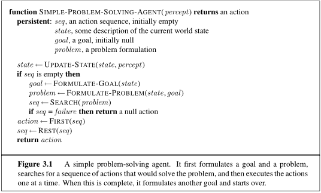
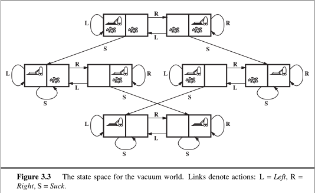

# Problem-Solving Agents

A **problem-solving agent** is a type of goal-based agent that uses **atomic representations**. In an atomic representation, each state of the world is treated as a whole without internal structure. The primary task of a problem-solving agent is to find a fixed sequence of actions that leads from an initial state to a desired goal state.

---

## 1. Problem-Solving Process

The design of a simple problem-solving agent follows a four-step cycle:



1. **Goal Formulation:** The agent adopts a specific goal based on its current situation and performance measure. Goals organize behavior by limiting the objectives to achieve and narrowing down the set of actions to consider.
2. **Problem Formulation:** The process of deciding what actions and states to consider given a goal.
3. **Search:** The process of examining future hypothetical action sequences to find a path leading to a goal state.
4. **Execution:** Carrying out the action sequence found by the search algorithm.

```
                     +--------------------+
                     |   Formulate Goal   |
                     +---------+----------+
                               |
                               v
                     +--------------------+
                     | Formulate Problem  |
                     +---------+----------+
                               |
                               v
                     +--------------------+
                     |       Search       |
                     +---------+----------+
                               |
                               v
                     +--------------------+
                     |      Execute       |
                     +--------------------+
```

---

## 2. Environment Assumptions

Standard problem-solving search algorithms assume the environment meets the following conditions:

* **Observable:** The agent always knows its current state.
* **Discrete:** Only a finite number of distinct actions are available at any given state.
* **Known:** The agent knows which states are reachable via each available action.
* **Deterministic:** Each action leads to exactly one predictable outcome.

> **Open-Loop Systems:** Because the environment is fully deterministic and predictable, the agent can execute its solution sequence without paying attention to percepts during execution. Ignoring percepts breaks the feedback loop between the agent and environment, making it an open-loop system.

---

## 3. Well-Defined Problems and Solutions

A problem is formally defined by five primary components:

| Component | Description | Example (Romania Navigation) |
| --- | --- | --- |
| **Initial State** | The state the agent starts in. | $\text{In}(\text{Arad})$ |
| **Actions** | Given state $s$, $\text{ACTIONS}(s)$ returns the set of applicable actions. | $\text{ACTIONS}(\text{In}(\text{Arad})) = \{\text{Go}(\text{Sibiu}), \text{Go}(\text{Timisoara}), \text{Go}(\text{Zerind})\}$ |
| **Transition Model** | Defined by $\text{RESULT}(s, a)$, returning the state that results from executing action $a$ in state $s$. | $\text{RESULT}(\text{In}(\text{Arad}), \text{Go}(\text{Zerind})) = \text{In}(\text{Zerind})$ |
| **Goal Test** | Checks whether a given state satisfies the target goal. | Check if $\text{state} = \{\text{In}(\text{Bucharest})\}$ |
| **Path Cost Function** | Assigns a numeric cost to a path, typically as the sum of individual step costs $c(s, a, s')$. | Sum of road distances in kilometers |

### Additional Key Terminology

* **State Space:** The set of all states reachable from the initial state through any sequence of valid actions. It forms a directed network or graph with states as nodes and actions as links.
* **Path:** A sequence of states connected by a sequence of actions.
* **Optimal Solution:** A solution path that achieves the lowest path cost among all possible valid solutions.

---

## 4. Abstraction in Problem Formulation

**Abstraction** is the process of removing unnecessary details from a world representation.

* **State Abstraction:** Omitting irrelevant real-world variables (e.g., weather, passenger presence, or radio stations when planning a driving route).
* **Action Abstraction:** Combining complex physical sub-actions into higher-level actions (e.g., "drive to Sibiu" instead of "turn steering wheel 1 degree left").

A good abstraction removes as much detail as possible while keeping the model valid and ensuring that abstract actions remain easy to perform in practice.

---

## 5. Example Problems

Problem-solving environments are divided into **toy problems** (used to benchmark and evaluate algorithm performance) and **real-world problems** (practical real-life applications).

### A. Toy Problems

#### 1. Vacuum World



* **States:** Defined by agent position (2 locations) and dirt presence (clean/dirty in 2 locations) yielding $2 \times 2^2 = 8$ total states. (For $n$ locations, total states $= n \cdot 2^n$).
* **Initial State:** Any state.
* **Actions:** $\text{Left}$, $\text{Right}$, $	ext{Suck}$.
* **Transition Model:** Standard movement effects; bumping into walls does not change location, and sucking a clean square leaves it clean.
* **Goal Test:** All locations are completely clean.
* **Path Cost:** Each action step costs 1 unit.

#### 2. 8-Puzzle (Sliding-Block Family)
* **States:** Locations of eight numbered tiles plus one blank space across a $3 \times 3$ grid. Total reachable states $= \frac{9!}{2} = 181,440$.
* **Initial State:** Any valid board configuration.
* **Actions:** Movement of the **blank space**: $\text{Left}$, $\text{Right}$, $\text{Up}$, or $\text{Down}$.
* **Transition Model:** Returns the new state formed by swapping the blank space with an adjacent tile.
* **Goal Test:** Board matches a designated target tile layout.
* **Path Cost:** Step cost of 1 per move.

#### 3. 8-Queens Problem
Goal: Place 8 queens on an $8 \times 8$ chessboard such that no queen attacks another.
* **Incremental Formulation:** Starts with an empty board; each action places one queen.
  * *Naive Approach:* Place a queen in any empty square. State space $\approx 1.8 \times 10^{14}$ states.
  * *Efficient Approach:* Place queens only in the leftmost empty column such that they are not attacked by any existing queen. State space drops to **2,057 states**.
* **Complete-State Formulation:** Starts with all 8 queens on the board and moves them around to eliminate attacks.

#### 4. Knuth's 4-Number Problem
Demonstrates how infinite state spaces can arise.
* **Initial State:** $4$.
* **Actions:** Apply $\text{factorial}$, $\text{square root}$, or $	ext{floor}$ operations.
* **Goal Test:** State reaches a specified target positive integer.

---

# Real-World Problems

While toy problems provide clean, controlled environments to benchmark search algorithms, real-world problems deal with the complexity, scale, and continuous nature of practical applications. Solutions to these problems carry real-world impact, but their formulations are often complex, non-standardized, and computationally intensive.  

## 1. Route-Finding and Airline Travel Planning

Route-finding involves finding a path from an initial location to a destination location through a network of roads, airways, or data paths. Applications range from consumer GPS navigation (e.g., Google Maps) to network packet routing and military logistics.  

* **State Space:** In simple driving navigation, a state is defined merely by a discrete location (e.g., $\text{In}(\text{Bucharest})$). However, in complex airline travel planning, a state must capture significantly more context:  
  * Current geographic location (e.g., airport terminal).  
  * Current time of day and calendar date.  
  * Historical flight segment details (previous layovers, fare basis codes, domestic vs. international status).  
* **Actions:** Boarding an available flight from the current airport that departs after the current time, allowing sufficient time for within-airport transfers.  
* **Transition Model:** Flying on a designated flight updates the state’s current location to the destination airport and sets the current time to the scheduled arrival time.  
* **Goal Test:** Checks whether the agent has reached the final destination specified in the user query.  
* **Path Cost Function:** Multi-objective function incorporating:
  * Financial cost (airfare, taxes, baggage fees).  
  * Total duration (flight time + layover/waiting time).  
  * Seat class, aircraft type, frequent-flyer points, and time-of-day preferences.  

**Real-World Complications:** Airlines use highly complex fare structures, and real-time execution often suffers from delays or cancellations. Advanced systems must generate contingency plans (e.g., backup connections) to handle potential flight disruptions.  

---

## 2. Touring Problems and the Traveling Salesperson Problem (TSP)

Unlike route-finding (where the goal is simply reaching a destination), touring problems require visiting a designated set of nodes.  

### Touring Problem Formulation
* **State Space:** Must track both the current location and the set of visited cities. For example, $\text{In}(\text{Vaslui}), \text{Visited}(\{\text{Bucharest}, \text{Urziceni}, \text{Vaslui}\})$.  
* **Goal Test:** Checks whether the agent has returned to the starting city and whether the set of visited cities includes every required city in the region.  

### Traveling Salesperson Problem (TSP)
A specialized touring problem where every city in a given graph must be visited exactly once, and the tour must return to the starting location while minimizing total distance/cost.  

* **Complexity:** TSP is NP-hard. As the number of cities $n$ grows, the state space expands exponentially, making exhaustive search impossible.  
* **Practical Applications:** Beyond human travel, TSP algorithms are widely used in industrial operations, such as:
  * Planning optimal movement paths for automated drills on printed circuit boards (PCBs).  
  * Warehouse logistics and stock-retrieval routing for automated factory robots.  

---

## 3. VLSI Layout Design

Very Large Scale Integration (VLSI) layout involves placing millions of electrical components (transistors, gates) on a single silicon microchip and wiring them together efficiently. It takes place after logical design and is typically split into two primary sub-problems:  

### Cell Layout
* Primitive components are grouped into logical functional units ("cells").  
* Each cell has a fixed physical footprint and specified connection points.  
* **Goal:** Position cells on the chip surface so they do not overlap, leaving sufficient space between them for interconnecting wires.  

### Channel Routing
* **Goal:** Find specific, non-overlapping routing paths for physical wires running through the narrow gaps (channels) between placed cells.  
* **Optimization Objectives (Path Cost):** Minimizing total chip surface area, reducing circuit signal delays, minimizing stray parasitic capacitance, and maximizing manufacturing yield.  
* **Search Challenge:** The search space is exceptionally massive due to millions of interconnected components, requiring sophisticated heuristic search methods.  

---

## 4. Robot Navigation

Robot navigation is a continuous generalization of discrete route-finding.  

* **Continuous vs. Discrete State Spaces:** Rather than choosing from a finite set of discrete roads, a physical robot moves through continuous physical space with an infinite number of possible locations and actions.  
* **Degrees of Freedom & Kinematics:**
  * A basic mobile robot moving on a flat floor operates in a 2D configuration space.  
  * A robot equipped with articulated arms, multi-jointed legs, or steering mechanisms operates in a high-dimensional search space representing all possible joint angles and positions.  
* **Discretization Techniques:** To apply standard search algorithms, advanced mathematical transformation techniques are required to convert continuous configuration spaces into finite, solvable representations.  
* **Real-World Uncertainties:** Physical robots must constantly compensate for noisy sensor readings (e.g., LiDAR, cameras) and execution inaccuracies in motor controls.  

---

## 5. Automatic Assembly Sequencing

First demonstrated by the FREDDY project (Michie, 1972), automatic assembly sequencing involves planning the step-by-step physical assembly of complex mechanical devices (e.g., electric motors).  

* **State Space:** Represents the current partial assembly configuration of components.  
* **Actions:** Attaching a new physical part to the existing sub-assembly.  
* **Geometrical Search Bottleneck:**
  * Generating valid actions is the most computationally expensive part of assembly planning.  
  * For every step, the system must perform complex geometric collision checks to ensure that adding a new part does not physically collide with previously installed parts.  
  * Choosing an incorrect assembly order can create a "deadlock" where a necessary internal piece cannot be added later without completely dismantling previously assembled sections.  

> **Protein Design (Biological Analogy):** A closely related computational search problem where the goal is to discover a specific sequence of amino acids that will reliably fold into a precise 3D protein structure capable of binding to target disease molecules.
---
